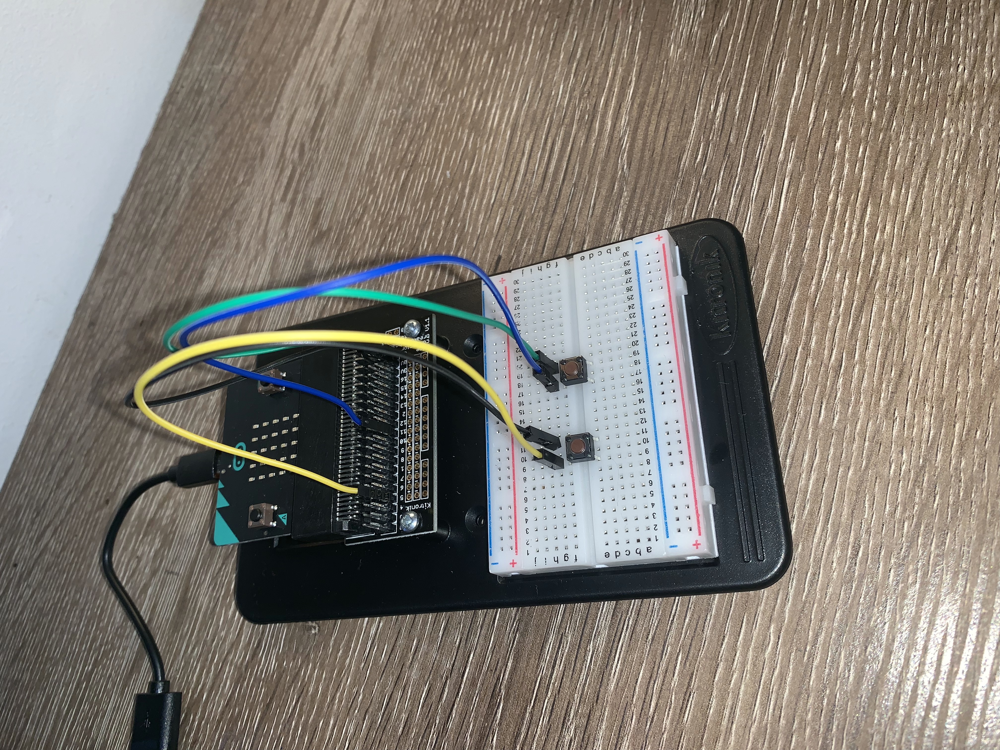
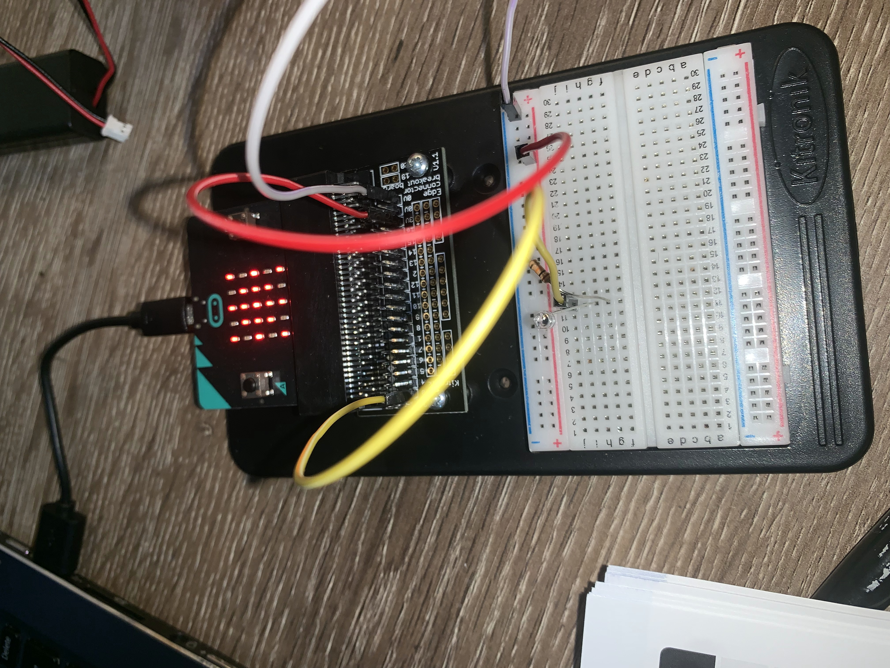
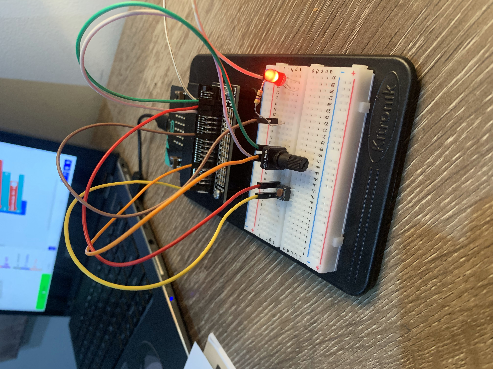
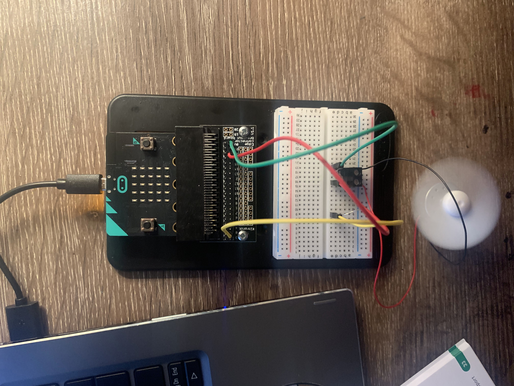
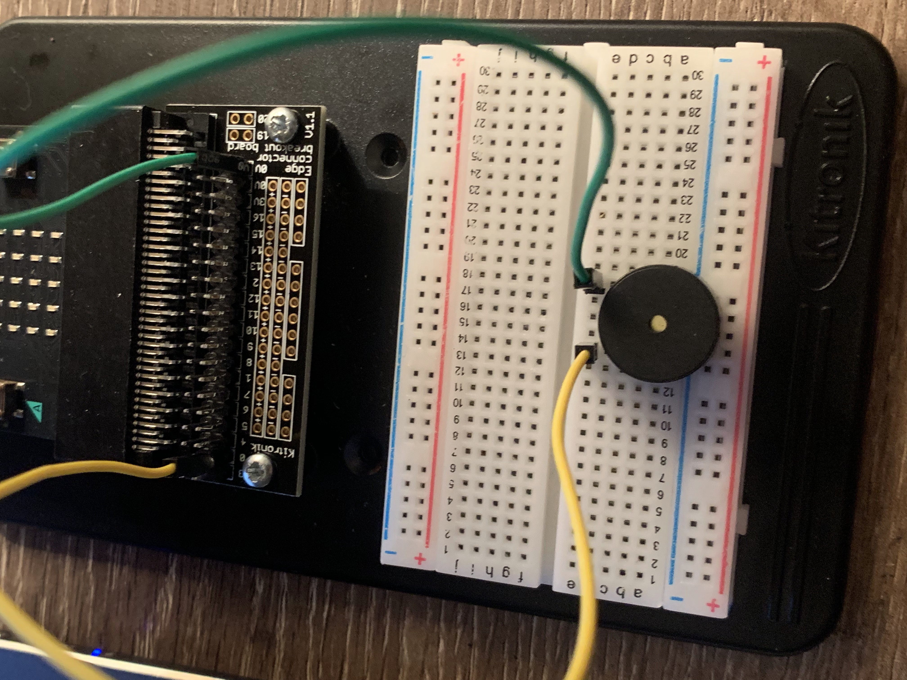

# Inventor Kit Experiments

*Markdown reference: https://guides.github.com/features/mastering-markdown/*

### Say Hello to the BBC micro:bit ###

Completed circuit

#### Reflection ####

This experiment was a great place to start with the micro:bit, considering I'd never used one before and had no idea how it worked. I learned how the device works at a basic level and it could be the basis of a real world application such as games or toys for kids.

### Using a Light Sensor & Analog Inputs ###

Completed circuit

#### Reflection ####

For the second experiment I learned about the threshold of the light sensor and how it can be changed to be more or less sensitive to light. I believe automatic lights in cars and  houses use a similar process to this experiment.

### Dimming an LED Using a Potentiometer ###

Completed circuit

#### Reflection ####

In this experiment, something I learned was that the resistors can control the amount of power that goes through something, such as an LED light, and prevents them from overheating or breaking. The dimmers are also able to put a light in between two states. Instead of a light just being on or off, it is able to be set to a certain brightness with a dimmer dial. eiling fans with adjustable speed settings use the same process.

### Using a Transistor to Drive a Motor ###

Completed circuit

#### Reflection ####

In this experiment, something I learned was how to connect the fan blade with the motor and the terminal connector.
This experiment could be the basis of a real world application such as an electric kettle. When a kettle is turned on, a process of heating begins. When the thermostat in the kettle reaches its peak temperature, it snaps open, pushes a lever that trips the circuit, cuts off the electric current, and switches off the kettle. The difference between these two is that the transistor keeps the motor going in a loop, whereas a kettle requires someone to start the process by pressing a button, and it won't repeat unless the button is pressed again

### Setting the Tone with a Piezo Buzzer ###

Completed circuit

#### Reflection ####

In this experiment, something new to me was the use of the buzzers, and how they are able to play a wide range of tones as well as series' of tones and melodies. A similar type of sound has been produced on the GameBoy, which uses its own version of the Piezo Buzzer.

