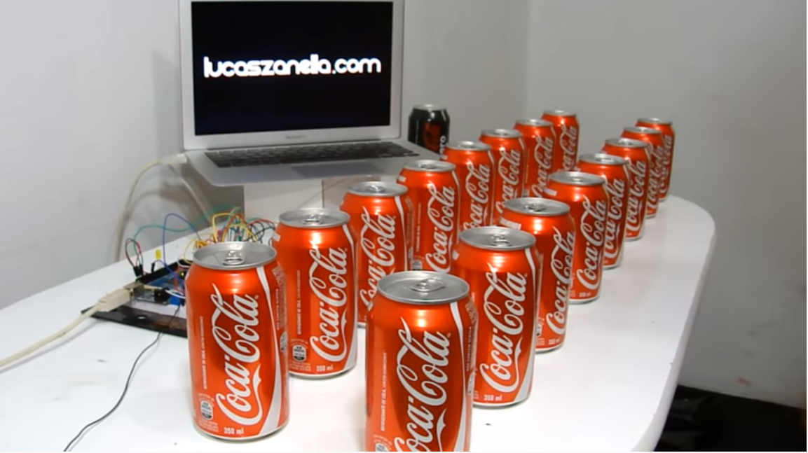
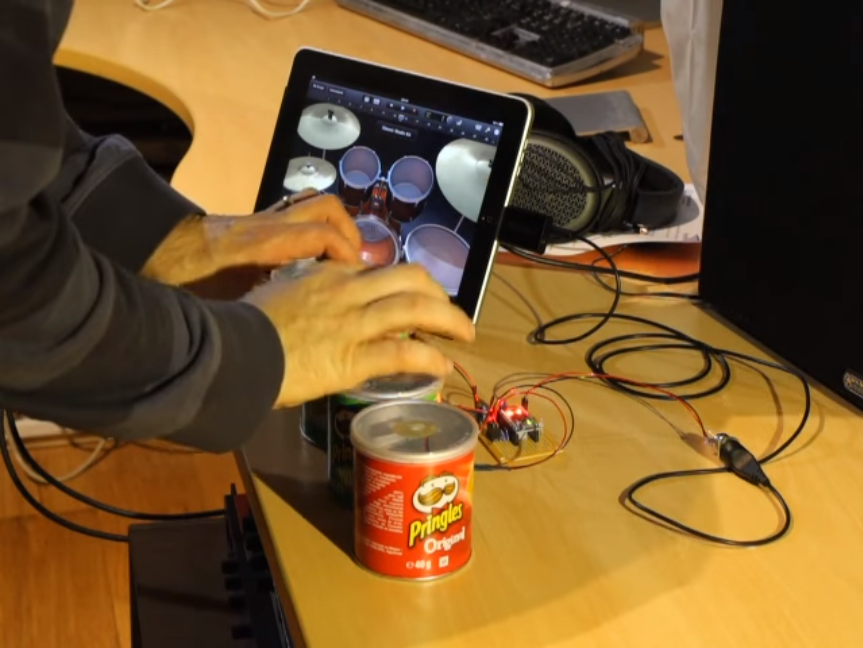
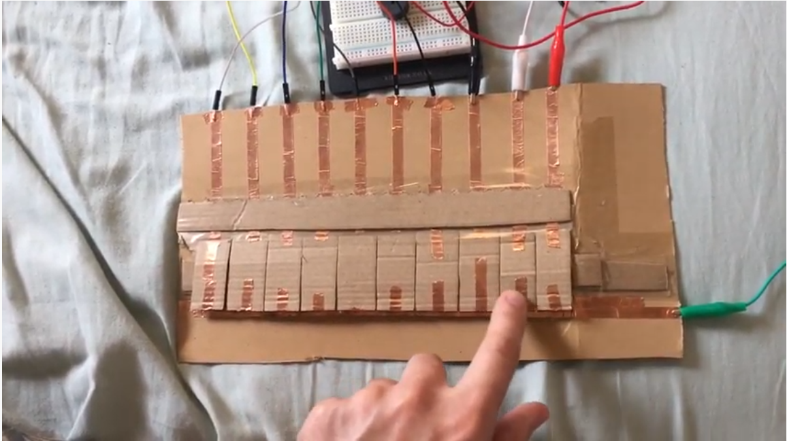
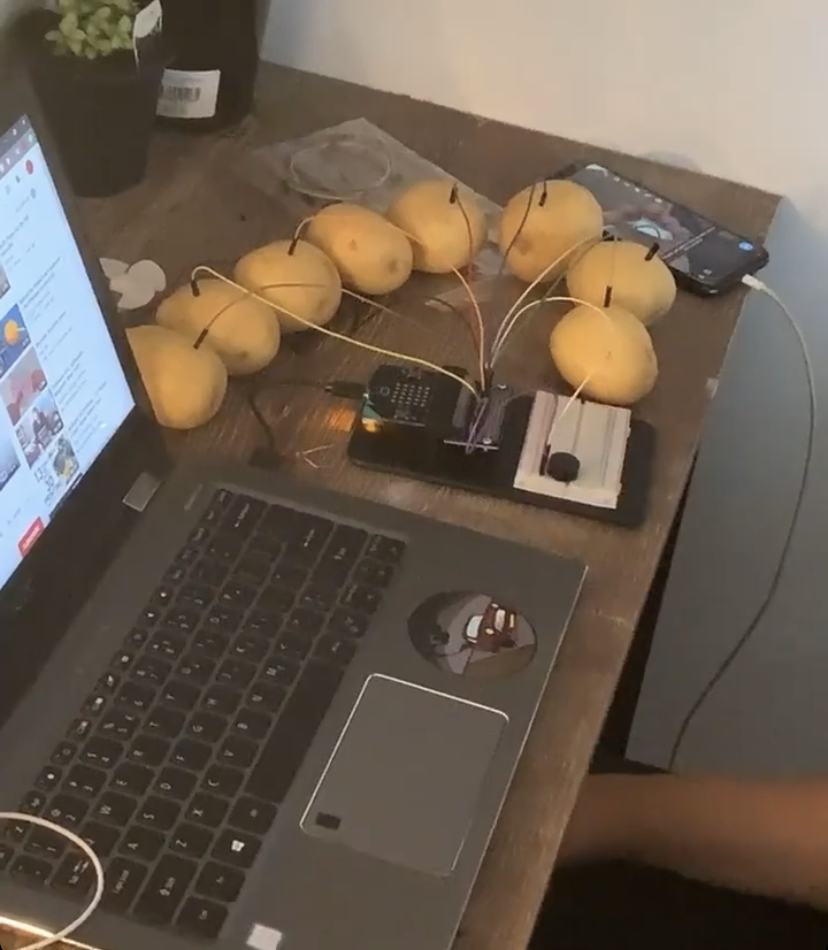
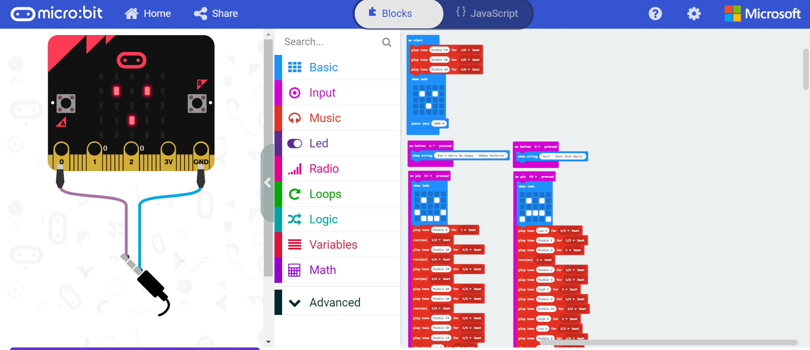
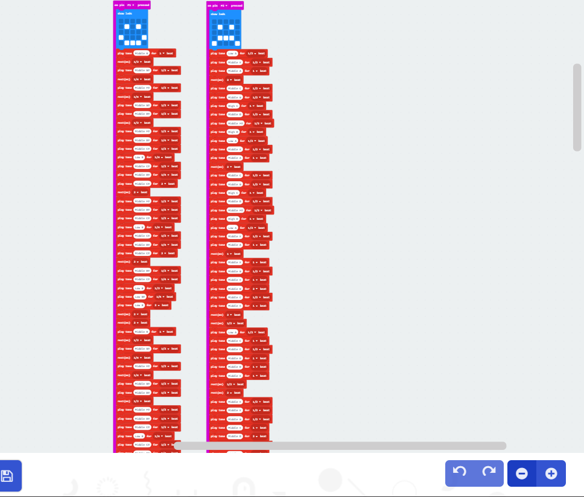

# Assessment 1: Replication project

*Fill out the following workbook with information relevant to your project.*

*Markdown reference:* [https://guides.github.com/features/mastering-markdown/](http://guides.github.com/features/mastering-markdown/)

## Replication project choice ##
Banana Keyboard

## Related projects ##
*Find about 6 related projects to the project you choose. A project might be related through  function, technology, materials, fabrication, concept, or code. Don't forget to place an image of the related project in the* `replicationproject` *folder and insert the filename in the appropriate places below. Copy the markdown block of code below for each project you are showing, updating the number* `1` *in the subtitle for each.*

### Related project 1 ###
Arduino Banana Piano

[https://www.youtube.com/watch?v=Lbkw0LFVZDI](https://www.youtube.com/watch?v=Lbkw0LFVZDI)

This project is very similar to the one on the Micro:bit website as it uses the same basic principles, but it is made with Arduino software. It also has a lot more keys than the basic Micro:bit one and each key plays an individual tone, rather than a melody or a series of tones. 

### Related project 2 ###
Coke Piano

[https://www.youtube.com/watch?v=Ttm62RBdOuo](https://www.youtube.com/watch?v=Ttm62RBdOuo)

This project is quite interesting because the person who created it has been able to make over 15 keys using coke cans, and linked the setup to their computer to play a wide range of sounds and loops. I also didn't see anywhere in the video that he was touching something connected to GND, so the programming might be very different and a lot more complex.

### Related project 3 ###
DIY Playable Drum Set

[https://www.youtube.com/watch?v=UVISquEcuzg](https://www.youtube.com/watch?v=UVISquEcuzg)

This project is related to mine because it uses the same pin press methods as the keyboard. The only difference is that the keys have been replaced with objects to simulate a drum kit and once pressed they produce a different type of sound.

### Related project 4 ###
Pringles Can Drum Kit

[https://www.youtube.com/watch?v=_TvVlkHtvJc](https://www.youtube.com/watch?v=_TvVlkHtvJc)

This project is related to the previous drum set project as it also has the same pin press methods, although this person decided to make the drum set out of Pringles cans.

### Related project 5 ###
Paper Piano with Arduino

[https://www.youtube.com/watch?v=_4cIv6qLaM8](https://www.youtube.com/watch?v=_4cIv6qLaM8)

This project is a more practical version of the banana keyboard as it is made out of paper and it takes up a little less space. Similar programming to the coke can keyboard is used in this one as the whole kit is connected to the creator's laptop and he's able to play a wide range of sounds.

### Related project 6 ###
Micro:bit Keyboard Tutorial

[https://www.youtube.com/watch?v=vEskS1VzGrs](https://www.youtube.com/watch?v=vEskS1VzGrs)

This project is more basic than the previous ones, but I really like the concept and the outcome, given how simple the programming is. It operates like a normal piano and has a very familiar design. It  also offers a lot of freedom as to how you'd want to design the physical outcome, and what tones or tone series you'd want each key to play.

## Reading reflections ##
*Reflective reading is an important part of actually making your reading worthwhile. Don't just read the words to understand what they say: read to see how the ideas in the text fit with and potentially change your existing knowledge and maybe even conceptual frameworks. We assume you can basically figure out what the readings mean, but the more important process is to understand how that changes what you think, particularly in the context of your project.*

*For each of the assigned readings, answer the questions below.*

### Reading: Don Norman, The Design of Everyday Things, Chapter 1 (The Psychopathology of Everyday Things) ###

Throughout my degree, I've learned that experience and ease of interaction are really important parts of design, as people decide whether or not something is worth their time based on these two things. If a device or a product is overly complicated and hard to use, people can get put off and not want to use it. This reading goes in-depth about this notion and shows how everyday interactions such as opening a door can be ruined with badly thought-out designs and therefore bad experiences. 
This reading made me think of ways I could keep ease of interaction in mind and create a product that isn't complicated and is easy to understand and operate.

### Reading: Chapter 1 of Dan Saffer, Microinteractions: Designing with Details, Chapter 1 ###

This reading brought a point across that I previously hadn't realised; that microinteractions, despite the name, are an extremely impactful aspect of design. The small, seemingly unimportant part of a product, such as the silent mode switch on a phone (as talked about in the reading) can be the downfall of an otherwise exceptional device. It makes me wonder how in-depth I should be looking into my future and present projects and what kinds of microinteractions may apply to my designs. There are so many things one should be considering in their design processes as there are so many things that can affect the way we experience, and interact with our products.

### Reading: Scott Sullivan, Prototyping Interactive Objects ###

Before I read this reading I hadn't really thought too deeply about how much we rely on technology in this day, and how future generations won't know what it was like before the digital age. There is so much technology incorporated into our everyday lives and we are so used to it at this point that we don't take notice of its presence sometimes. The reading also shed some light on the versatility of technology design. I am aware that the platform for emerging technology is vast and applicable to a lot of things, but I realised that there are so many things in my life that it could be applied to. The way we communicate and travel are two very common aspects of our lives that technology can be designed and built for, but there are countless other things that this applies to as well. Almost any idea can be made into something physical, and for the most part they have. We have access to millions of products, big and small, that are designed for the most specific of situations. This reading serves as encouragement for designers to ideate and explore any avenue they want, as anything, no matter how specific, niche or broad, is able to be put into physical form.

## Interaction flowchart ##
*Draw a flowchart of the interaction process in your project. Make sure you think about all the stages of interaction step-by-step. Also make sure that you consider actions a user might take that aren't what you intend in an ideal use case. Insert an image of it below. It might just be a photo of a hand-drawn sketch, not a carefully drawn digital diagram. It just needs to be legible.*

## Process documentation

At first I wasn't sure what direction I wanted to go in for the assignment but after looking for inspiration on the web I figured it out eventually that I wanted to make a keyboard that plays an entire song on each key that corresponds with a mood or a situation. I started testing the project with some oranges and experimented with different tones and melodies, starting with the Simpsons theme song. 

After a successful test run with the oranges I decided to up the anti and add more keys. We didn't have enough oranges in the house so I switched to potatoes. Unfortunately the keyboard stopped working after that, as I had changed the code from the original. One project that I drew inspiration from was the 'Micro:bit Keyboard Tutorial' video (Related Project 6). I tried to recreate this project so I could use its coding and layout as a starting point for my replication project. I followed all the instructions and made sure my codes were exactly the same as in the video. However, every time I downloaded it to the micro:bit, the piano would never work. I tried countless times with potatoes, then with foil, but it only ever worked with no more than 2 keys. I still don't 100% understand what wasn't working, but I could only use pins 0, 1 and 2 I couldn't do anything with the other pins. It would have made the project a lot more interesting if I could have made more than 2 working keys.

Since I could only make the device operate with 2 keys I decided to switch out the potatoes and make a little keyboard myself. I started with a strip of aluminium foil to test if i could close the circuit with it. Since that worked, I made the keys out of some paper and put the foil underneath.

The paper underneath the keys ensures that they aren't always in contact with the GND pin, but can be pressed down onto the foil strip, which closes the circuit and then triggers the songs to play.

The pins are all secured to the foil and taped to their keys or the base.

Each key has a little face icon that corresponds with its respective song.

I ended up reverting to the original code and just added other elements like the use of the buttons and the LED display. Making the songs wasn't very hard, but it took a long time to finish.

Here's a bit more of the code. As you can see, there are a lot of tones I had to make.

## Project outcome ##

### Happy / Sad Keyboard ###

### Project description ###

Happy Sad Keyboard is a piano-like instrument with two keys. Each key has an icon on it indicating the mood of the person operating the instrument. If the person is happy, they press the key with the yellow smiley face icon and a smiley face will appear on the Micro:bit. Then the buzzer on the breadboard will play "Don't Worry Be Happy" by Bobby McFerrin. The same process occurs when the other key is pressed, but instead a sad face appears on the LEDs and the buzzer plays "Hurt" by Nine Inch Nails.
The keyboard's programming is almost identical to the original Banana Keyboard one, but I've included the use of the LEDs and Buttons A and B to display the titles of each song. It is all pretty simple and easy to operate, however the complexity lies in the making of the songs on the Micro:bit editor. I had to individually insert every tone and rest for both songs, which was a time-consuming process. However, it was worth it as they both ended up sounding pretty good.
I decided to switch from fruit and vegetables to paper and foil for the sake of practicality and tidyness. Although it isn't very developed I feel like the device looks (somewhat) more sophisticated when it's been constructed neatly, rather than having pins stuck into the side of a potato.

### Showcase image ###

### Additional view ###

The following images show a closer look at the setup of the device and the construction of the keys.

### Reflection ###

I'm somewhat happy with how the device turned out, however I was quite disappointed that I couldn't figure out how to make more keys with the other pins. I tried multiple methods from tutorials on YouTube to try to make it work, but I could only ever get a tone to play through pins 1 and 2. Because of this setback, I wanted to make the keyboard more interesting by making each key play a song rather than a single tone or a short series of tones. The outcome is fully functional and the songs ended up sounding pretty good, which I am very happy with since it took a long time to figure out the individual tones.

Certain techniques used in class and in the Inventor's Kit booklet were useful and I could get basic programming to work on the Micro:bit, but as soon as I tried a method from on the web, for some reason none of the keys pressed could create a tone. It was pretty interesting to see that I could make a key out of almost any fruit or vegetable and even candy. 

Once I figure out how to make more pins work, I can expand the project and make a functioning keyboard with a lot more keys. I can then experiment with different tones and maybe using a different speaker to make it interesting and engaging.
